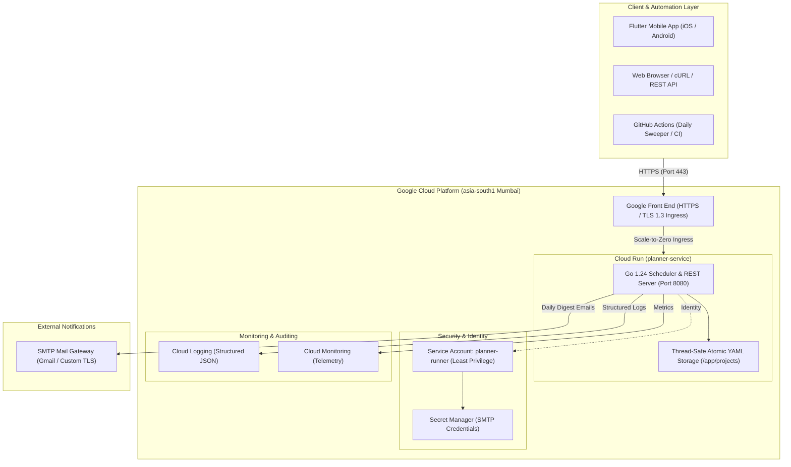

# 📋 Planner — Distributed Task Engine & Scheduler

[](https://github.com/Chief-Strategist-J/planner/actions/workflows/ci.yml)
[](https://github.com/Chief-Strategist-J/planner/actions/workflows/daily-reminder.yml)
[-4285F4?logo=googlecloud&logoColor=white)](https://planner-service-715525810343.asia-south1.run.app)
[-success)](./adr/0001-google-cloud-run-free-tier-deployment.md)
[](./worker)
[](./scheduler-app)

A cloud-native, thread-safe task management and automated scheduling platform. Built with a high-performance **Go backend**, deployed serverless to **Google Cloud Run** in `asia-south1` (Mumbai) operating within a strict **$0.00 / month Free Tier** boundary, and accompanied by a cross-platform **Flutter mobile application**.

---

## 🏗️ System Architecture



---

## 📦 Repository Structure

```
planner/
├── .github/
│   └── workflows/
│       ├── ci.yml                     # Automated Go unit/integration tests & Terraform validation
│       ├── daily-reminder.yml         # 10:00 AM IST daily task sweep & Step Summary table generator
│       └── cloud-run-schedule.yml     # Working hours (09:00 AM – 06:00 PM IST) auto start/stop
├── adr/
│   ├── 0001-google-cloud-run-free-tier-deployment.md           # Architecture Decision: Cloud Run Free Tier
│   └── 0002-daily-email-reminders-and-automated-lifecycle.md   # Architecture Decision: SMTP & Lifecycle
├── infra/
│   ├── scripts/
│   │   ├── setup.sh                   # GCP project, API enablement, and least-privilege IAM provisioning
│   │   ├── deploy-app.sh              # Cloud Build & Cloud Run zero-downtime deployment script
│   │   └── destroy.sh                 # Complete automated resource teardown ($0.00 guarantee)
│   └── terraform/
│       ├── main.tf                    # Declarative Terraform 1.5+ infrastructure specifications
│       ├── variables.tf               # Regional, instance, and project variables
│       ├── outputs.tf                 # Live service URL & service account outputs
│       └── imports.tf                 # Conflict-free resource adoption definitions
├── scheduler-app/                     # Flutter cross-platform mobile application
│   ├── lib/                           # Clean Architecture Dart source (core, domain, presentation)
│   └── pubspec.yaml                   # Flutter dependency specifications
└── worker/                            # Core Go REST API & Scheduler Engine
    ├── src/
    │   ├── api/rest/v1/router/        # HTTP handlers & routing
    │   ├── features/projects/         # Project domain, repository, and service
    │   ├── features/tasks/            # Task domain, atomic YAML repository, and service
    │   ├── infra/email/               # SMTP authenticated sender & logger fallback
    │   ├── infra/scheduler/           # Daily reminder sweep scanner
    │   └── shared/types/              # Closed RFC-compliant ApiResponse envelopes
    ├── server/main.go                 # Application entry point with --sweep-only CLI flag
    └── Dockerfile                     # Multi-stage hardened Alpine container image (~25 MB)
```

---

## 🌐 Live API Endpoints

* **Base URL:** [`https://planner-service-715525810343.asia-south1.run.app`](https://planner-service-715525810343.asia-south1.run.app)
* **Region:** `asia-south1` (Mumbai, India — lowest latency for Bengaluru and Southern India)

| Method | Endpoint | Description | Sample Response |
|---|---|---|---|
| `GET` | `/health` | Liveness & readiness probe | `{"status":"healthy","service":"planner-worker"}` |
| `GET` | `/` | Service root descriptor | `{"service":"planner-worker","version":"v1"}` |
| `GET` | `/api/v1/projects` | List all projects (supports `?page=1&pageSize=10`) | `{"status":200,"data":[...]}` |
| `POST` | `/api/v1/projects` | Register a new project | `{"status":201,"data":{"projectId":"proj-01"}}` |
| `GET` | `/api/v1/projects/:id` | Fetch specific project details | `{"status":200,"data":{...}}` |
| `PATCH` | `/api/v1/projects/:id` | Update project metadata | `{"status":200,"data":{...}}` |
| `DELETE`| `/api/v1/projects/:id` | Remove project & associated tasks | `{"status":200,"data":{"deleted":true}}` |
| `GET` | `/api/v1/projects/:id/tasks` | List tasks (filter: `?status=PENDING`) | `{"status":200,"data":[...]}` |
| `POST` | `/api/v1/projects/:id/tasks` | Create task with priority & due date | `{"status":201,"data":{...}}` |
| `GET` | `/api/v1/projects/:id/tasks/:taskId` | Fetch specific task record | `{"status":200,"data":{...}}` |
| `PATCH`| `/api/v1/projects/:id/tasks/:taskId/status` | Update task status (`PENDING`, `IN_PROGRESS`, `COMPLETED`) | `{"status":200,"data":{...}}` |
| `DELETE`| `/api/v1/projects/:id/tasks/:taskId` | Remove task record | `{"status":200,"data":{"deleted":true}}` |
| `POST` | `/api/v1/scheduler/trigger` | Trigger daily reminder sweep on-demand | `{"status":200,"data":{"pendingTasksFound":0}}` |

---

## ⏰ Automated Working-Hours Lifecycle & Daily Reminders

Aliged with **Indian Standard Time (IST / Bengaluru)**:

```
Timeline (IST / Bengaluru):
---------------------------------------------------------------------------------------------
09:00 AM IST (Mon–Fri)   ---> 🚀 Cloud Run Lifecycle Scheduler (.github/workflows/cloud-run-schedule.yml)
                                Wakes up / deploys Cloud Run service in asia-south1.
                                Service is online for daily requests.

10:00 AM IST (Daily)     ---> 📧 Daily Reminder Sweep (.github/workflows/daily-reminder.yml)
                                Issues POST /api/v1/scheduler/trigger.
                                Scans all projects for PENDING tasks.
                                Dispatches authenticated SMTP email digest to assignees.
                                Publishes rich Markdown table to GitHub Step Summary.

06:00 PM IST (Mon–Fri)   ---> 🛑 Cloud Run Lifecycle Scheduler (.github/workflows/cloud-run-schedule.yml)
                                Automatically scales down / destroys service.
                                Strictly guarantees $0.00 idle cost outside working hours.
---------------------------------------------------------------------------------------------
```

---

## 💰 Free Tier & Zero-Idle-Cost Guarantee

This system runs on Google Cloud's permanent Free Tier:

* **True Scale-to-Zero (`min_instances = 0`):** No container runs when idle. 0 CPU-seconds = **$0.00**.
* **Instance Ceiling (`max_instances = 1`):** Prevents unexpected horizontal autoscaling or bill runaways.
* **CPU Idle Throttling (`--cpu-throttling`):** CPU is suspended between requests.
* **Minimal Image Size:** Compiled static Alpine Go binary is **~25 MB** (consuming only 5% of Google Artifact Registry's 500 MB monthly free quota).
* **Guaranteed $0.00 Inactive Cost:** Even if completely unused for months, charges remain **$0.00 (₹0)**.

For full unit economics, formulas, and pricing comparisons, see [`adr/0001-google-cloud-run-free-tier-deployment.md`](./adr/0001-google-cloud-run-free-tier-deployment.md).

---

## 🔒 Security & Least-Privilege IAM (PoLP)

* **Isolated Service Account:** Runs under `planner-runner@planner-app-66733.iam.gserviceaccount.com`. The default Compute Engine `Editor` account is completely bypassed.
* **Granular Leaf Roles Only:**
  * `roles/logging.logWriter`: Can only write structured application logs.
  * `roles/monitoring.metricWriter`: Can only publish telemetry metrics.
  * `roles/secretmanager.secretAccessor`: Can only read runtime secrets.
* **Zero Long-Lived Credentials:** No `.json` service account keys exist in the repository; authentication uses Google Cloud Workload Identity.
* **Hardened Alpine Runtime:** Multi-stage build strips all build tools (`go`, `gcc`, `git`), leaving a minimal, vulnerability-scanned binary.

---

## 🚀 Local Development Quickstart

### Prerequisites
* **Go:** `1.23` or higher
* **Flutter SDK:** `3.19` or higher
* **Terraform:** `1.5.0` or higher
* **Google Cloud SDK (`gcloud`):** Authenticated with your GCP project

### 1. Clone with Submodules
```bash
git clone --recurse-submodules https://github.com/Chief-Strategist-J/planner.git
cd planner
```

### 2. Run the Go Backend Locally
```bash
cd worker
go mod download
go run server/main.go
# Server starts on http://localhost:8080
```

To run only the scheduler sweep:
```bash
go run server/main.go --sweep-only
```

Run test suite:
```bash
go test -v -count=1 ./...
```

### 3. Run the Flutter Mobile App
```bash
cd ../scheduler-app
flutter pub get
flutter run
```

### 4. Deploy to Google Cloud Run
```bash
# Provision IAM, APIs, and Artifact Registry:
./infra/scripts/setup.sh

# Build & Deploy to Cloud Run:
./infra/scripts/deploy-app.sh
```

---

## 📚 Architecture Decision Records (ADRs)

* [ADR 0001: Google Cloud Run Free-Tier Deployment & Least Privilege IAM](./adr/0001-google-cloud-run-free-tier-deployment.md)
* [ADR 0002: Daily Email Reminders, SMTP Configuration & Working-Hours Lifecycle](./adr/0002-daily-email-reminders-and-automated-lifecycle.md)

---

## 📄 License

Licensed under the MIT License.
