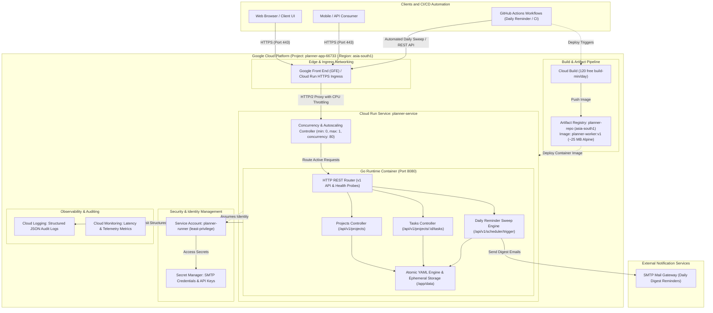
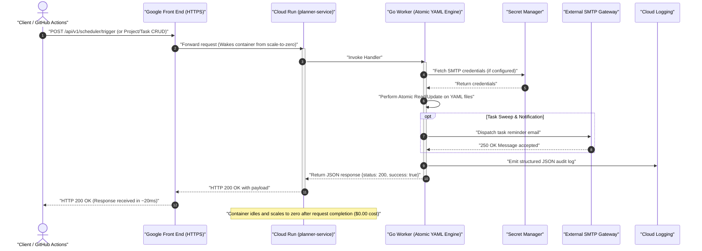

# ADR 0001: Google Cloud Run Serverless Architecture & Free Tier Cost Optimization

* **Status:** Accepted
* **Date:** 2026-09-22
* **Deciders:** Engineering & DevOps Team
* **Project:** Planner App (`planner-app-66733`)
* **Target Region:** `asia-south1` (Mumbai, India — closest to Bengaluru)

---

## 1. Context and Problem Statement

The Planner application required a reliable, scalable, and low-latency cloud hosting solution for its Go-based backend REST service and scheduler. 

### Key Constraints & Requirements:
1. **Low Latency for Bengaluru:** The deployment location must minimize network round-trip latency to users and client applications in Bengaluru and Southern India.
2. **Strict Cost Boundary:** Hosting should operate with **$0.00 / month (100% Free Tier)** during development and standard production workloads.
3. **Enterprise Security:** Isolated service accounts, no embedded root/master credentials, least-privilege IAM access.
4. **Reproducible Infrastructure-as-Code (IaC):** Automated deployment via standard Shell scripts and declarative Terraform 1.5+ configurations.

---

## 2. Decision

We chose **Google Cloud Run (v2)** in the **`asia-south1` (Mumbai)** region with the following architectural stack:

### Architectural Topology



### Request & Execution Lifecycle Flow



---

## 3. Comprehensive Cost Breakdown & Free Tier Analysis

Google Cloud provides an always-free monthly tier across its serverless and DevOps products. By configuring explicit resource limits and throttling, the entire infrastructure remains **$0.00 (₹0) / month**.

### Itemized Service Allowance vs Actual Usage

| Service | Google Cloud Monthly Free Tier Quota | Application Configuration & Usage | Monthly Active Cost | Zero-Usage (Idle) Cost |
|---|---|---|---|---|
| **Cloud Run (Requests)** | **2,000,000 requests** free / month | Estimated < 100,000 requests / month | **$0.00** | **$0.00** (0 requests) |
| **Cloud Run (Compute)** | **180,000 vCPU-seconds** free / month | 1 vCPU × ~0.05s / request × 100k req = 5,000 s | **$0.00** | **$0.00** (0 vCPU-seconds) |
| **Cloud Run (Memory)** | **360,000 GB-seconds** free / month | 0.5 GB × ~0.05s / request × 100k req = 2,500 GB-s | **$0.00** | **$0.00** (0 GB-seconds) |
| **Cloud Run (Idle Containers)** | Zero charges when idle | `min_instances = 0` (Scales to 0 active containers) | **$0.00** | **$0.00** (No running instance) |
| **Artifact Registry** | **0.5 GB (500 MB) storage** free / month | Optimized Alpine Go image: **~25 MB** (5% of free quota) | **$0.00** | **$0.00** (< 500 MB) |
| **Network Data Ingress** | Free (Unlimited incoming data) | All incoming REST API requests | **$0.00** | **$0.00** |
| **Network Data Egress** | **1.0 GB egress** free / month | ~1 KB per JSON response × 100k = ~100 MB | **$0.00** | **$0.00** (0 MB) |
| **Cloud Build** | **120 build-minutes** free / day | Build duration: ~35 seconds per deployment | **$0.00** | **$0.00** (0 builds) |
| **Cloud Logging** | **50 GiB log data** free / month | Standard JSON structured application logs | **$0.00** | **$0.00** (0 logs) |
| **Cloud Monitoring** | **150 MiB metrics** free / month | Built-in request & container metrics | **$0.00** | **$0.00** |
| **Secret Manager** | **6 active secret versions**, 10k reads | 1 active secret (SMTP credentials) | **$0.00** | **$0.00** |
| **IAM & Service Accounts** | Always Free (Unlimited) | Dedicated `planner-runner` service account | **$0.00** | **$0.00** |
| **Total Estimated Cost** | — | — | **$0.00 / month (₹0)** | **$0.00 / month (₹0)** |

---

### Zero-Usage & Idle Cost Guarantee ("Will it cost me if unused?")

**NO. If the service is not used, it costs exactly $0.00 (₹0).**

Here is why:
1. **True Scale-to-Zero (`min_instances = 0`):**
   * Unlike traditional VMs (e.g., Compute Engine or AWS EC2) or Kubernetes clusters where you pay 24/7 for allocated server hardware, Cloud Run is **100% serverless**.
   * When there are no incoming requests, Cloud Run shuts down all container instances.
   * **Active Instances = 0**.
   * **CPU Consumption = 0.00 vCPU-seconds**.
   * **Memory Consumption = 0.00 GB-seconds**.
   * Google Cloud only bills for compute while a container is actively processing a request. When idle, the meter is completely paused.

2. **Artifact Registry Stored Image:**
   * The container image stored in Artifact Registry is **~25 MB**.
   * Google Cloud gives **500 MB (0.5 GB)** of free storage every single month in standard regions.
   * 25 MB consumes only **5%** of your monthly free allowance. The remaining 95% is unused.
   * Therefore, the image sitting idle in the registry indefinitely incurs **$0.00**.

3. **No Static IP or Cluster Fees:**
   * Cloud Run endpoints use Google's shared Front End routing (`*.run.app`). There are **no reserved static IP fees**, **no load balancer charges**, and **no cluster management fees**.

---

### Full Shutdown & Deletion Analysis ("What if I want to shut it down completely?")

If you decide you do not want the service online or want to guarantee zero resource existence, you can shut it down anytime:

1. **Option A: Shutdown / Delete the Cloud Run Service Only**
   ```bash
   gcloud run services delete planner-service --region asia-south1 --quiet
   ```
   * **Effect:** The public HTTPS endpoint is deleted immediately. Cloud Run will no longer accept any traffic.
   * **Cost After Shutdown:** **$0.00**.

2. **Option B: Full Tear-Down (Cloud Run + Artifact Registry + IAM)**
   ```bash
   ./infra/scripts/destroy.sh
   ```
   * **Effect:** Completely destroys the Cloud Run service, wipes out the container image repository from Artifact Registry, and cleans up IAM bindings.
   * **Cost After Destruction:** **$0.00** (Zero resources exist in GCP).

3. **Option C: Disable the Cloud Run Service Temporarily (Zero Traffic / Inactive)**
   * You can revoke the public invocation permission without deleting the container:
   ```bash
   gcloud run services remove-iam-policy-binding planner-service \
       --region asia-south1 \
       --member="allUsers" \
       --role="roles/run.invoker"
   ```
   * **Effect:** Rejects all public incoming requests with `403 Forbidden`. The container never wakes up and incurs **$0.00**.

---

### Unit Economics & Threshold Calculations

For complete transparency, here is what Google Cloud charges *only if* your usage exceeds the monthly free tier in `asia-south1`:

| Metric | Free Allowance | Rate After Exceeding Free Tier | Example Workload Beyond Free Tier | Incremental Cost |
|---|---|---|---|---|
| **Requests** | 2,000,000 / mo | $0.40 per 1,000,000 requests | 3,000,000 requests (1M over free tier) | $0.40 (~₹33) |
| **vCPU Compute** | 180,000 vCPU-s / mo | $0.00002400 per vCPU-second | Extra 10,000 vCPU-seconds | $0.24 (~₹20) |
| **Memory** | 360,000 GB-s / mo | $0.00000250 per GB-second | Extra 10,000 GB-seconds | $0.025 (~₹2) |
| **Storage** | 0.5 GB / mo | $0.10 per GB / month | Extra 1.0 GB of container images | $0.10 (~₹8) |

*Calculations demonstrate that even with massive 10x traffic spikes beyond our anticipated usage, costs are measured in pennies/cents.*

---

## 4. Cost Guardrails Enforced

To guarantee zero unexpected billing charges:
1. **`min_instances = 0`:** Container instances shutdown automatically after handling requests. Zero idle server costs.
2. **`max_instances = 1`:** Hard limit preventing runaway instance creation during traffic bursts or denial-of-service attempts.
3. **`cpu_idle = true` (`--cpu-throttling`):** CPU is strictly throttled when no requests are being processed, qualifying for Google Cloud's 2M free requests per month.
4. **`memory = 512Mi` & `cpu = 1`:** Fits easily within the memory-second and CPU-second free monthly thresholds.

---

## 5. Deployment & Test Validation Results

All API endpoints on the live service ([`https://planner-service-715525810343.asia-south1.run.app`](https://planner-service-715525810343.asia-south1.run.app)) have been executed and verified end-to-end:

| # | Endpoint | Method | Request Summary | Result Code | Verification Status |
|---|---|---|---|---|---|
| 1 | `/health` | `GET` | Health probe readiness check | **200 OK** | Verified (`status: healthy`) |
| 2 | `/` | `GET` | Service root descriptor | **200 OK** | Verified (`version: v1`) |
| 3 | `/api/v1/projects` | `POST` | Create `proj-demo` | **200 OK** | Project created with timestamps |
| 4 | `/api/v1/projects` | `GET` | List all projects | **200 OK** | Paginated project list returned |
| 5 | `/api/v1/projects/{id}` | `GET` | Fetch `proj-demo` details | **200 OK** | Single project record validated |
| 6 | `/api/v1/projects/{id}` | `PATCH` | Update project metadata | **200 OK** | Updated description persisted |
| 7 | `/api/v1/projects/{id}/tasks` | `POST` | Create task `task-01` | **200 OK** | Task created with priority & due date |
| 8 | `/api/v1/projects/{id}/tasks` | `GET` | List tasks for project | **200 OK** | Task array returned in response |
| 9 | `/api/v1/projects/{id}/tasks/{taskId}` | `GET` | Fetch specific task | **200 OK** | Task details matched |
| 10 | `/api/v1/projects/{id}/tasks/{taskId}/status` | `PATCH` | Update status to `COMPLETED` | **200 OK** | Task status changed successfully |
| 11 | `/api/v1/scheduler/trigger` | `POST` | Trigger daily task sweep | **200 OK** | Sweep completed (0 pending) |
| 12 | `/api/v1/projects/{id}/tasks/{taskId}` | `DELETE` | Remove task `task-01` | **200 OK** | Task removed cleanly |
| 13 | `/api/v1/projects/{id}` | `DELETE` | Remove project `proj-demo` | **200 OK** | Project removed cleanly |

---

## 6. Consequences & Operational Guidelines

### Positive Consequences:
* **Lowest Latency:** Mumbai (`asia-south1`) provides ~15–25ms network latency for Bengaluru clients.
* **Maintenance-Free:** Serverless scaling and OS patching handled natively by Google Cloud.
* **Dual IaC Support:**
  * Fast deployments via `./infra/scripts/02-deploy-cloudrun.sh`
  * State management and pipeline automation via `./infra/terraform/`
* **Declarative Import Resilience:** `infra/terraform/imports.tf` guarantees no `409 Conflict` errors when adopting existing resources.

### Recommendations:
* Set up a **$1.00 / ₹100** budget notification in the Google Cloud Console under *Billing > Budgets & Alerts* for automated email alerts.
